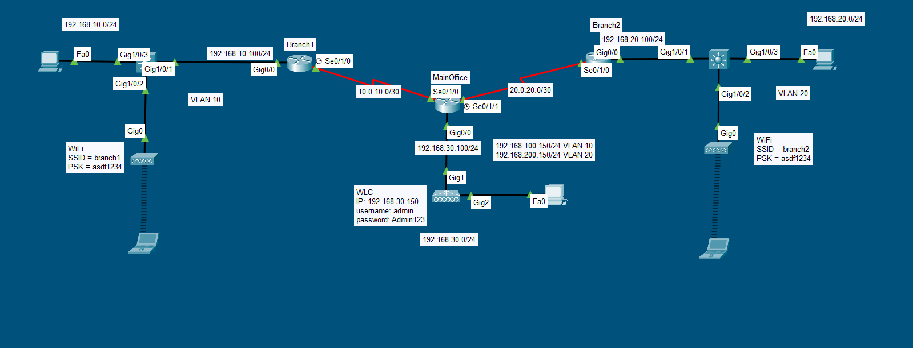

### Wireless Labs in Packet Tracer

Making WLANs in fun in Packet Tracer but with some tricks
- Always use FlexConnect mode
- Since we are using FlexConnect, we have to make LAP to Switch connection as trunk
- make management vlan as native vlan for all the trunks

I saw this topology from someone in discord and created the same in Packet Tracer myself.

Happy Learning!
